<p align="center">
  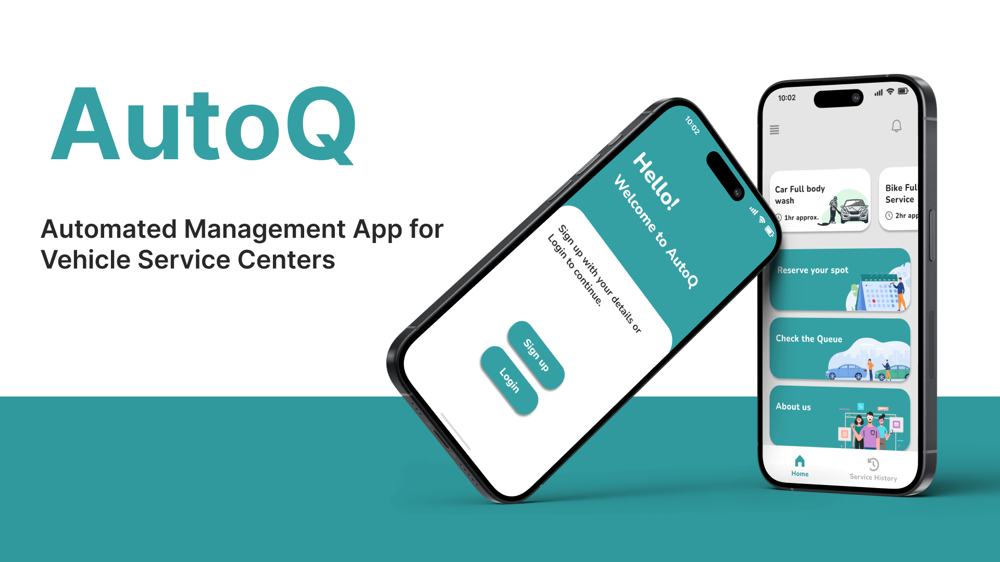
</p>

<h1 align="center">AutoQ - Vehicle Service Center Management App</h1>

AutoQ is a mobile application designed to streamline vehicle service management. It provides users with the convenience of booking appointments, tracking their service queue in real-time, and receiving updates about their vehicle's servicing progress. Built with Flutter, Dart, Tailwind, and Firebase, AutoQ aims to improve customer satisfaction while enhancing the operational efficiency of service centers.

---
## Features

- **User-Friendly Appointment Booking**  
  Effortlessly book and manage service appointments through an intuitive interface.

- **Real-Time Queue Tracking**  
  Monitor service progress and queue status live, reducing uncertainty and wait times.

- **Automated Notifications**  
  Stay informed with alerts about appointment confirmations, reminders, and service updates.

- **Enhanced Communication**  
  Seamless interaction between customers and service centers, enabling real-time updates and recommendations.

---

## Technologies Used

<p align="center">
  
  
  
</p>

---


## How It Works

1. **Appointment Booking**  
   Users can select services and book appointments directly through the app.

2. **Queue Management**  
   Real-time updates on service status, queue position, and estimated completion time.

3. **Notifications**  
   Automated reminders for appointments and updates on delays or completion.

4. **Admin Dashboard**  
   Service centers can manage appointments, monitor queues, and analyze performance.

---

## Installation

### Prerequisites
- Android device with Android 6.0 or higher
- Flutter SDK installed on your development machine

### Steps
1. Clone the repository:
   ```bash
   git clone https://github.com/PahanKawindu/AutoQ.git
   ```
2. Navigate to the project directory:
   ```bash
   cd autoq
   ```
3. Install dependencies:
   ```bash
   flutter pub get
   ```
4. Run the app on an emulator or physical device:
   ```bash
   flutter run
   ```
---

### Screenshots

Here are some interface screenshots of the application:
<h3>Login/Signup:<h3>
<p align="center">
  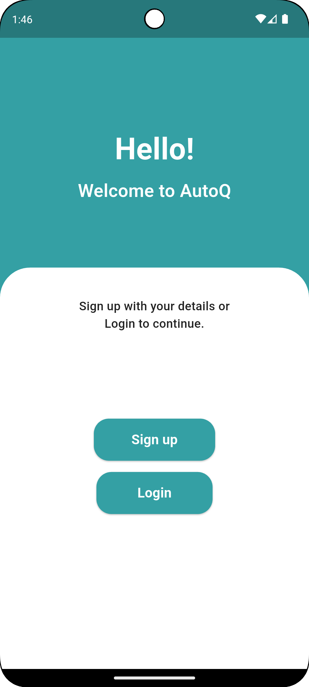
  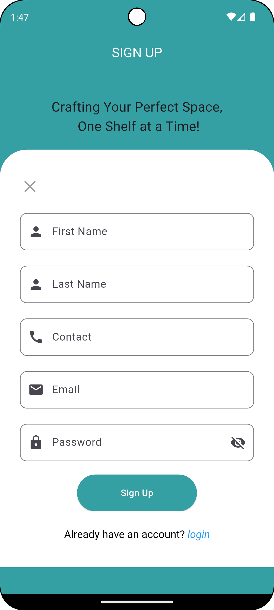
  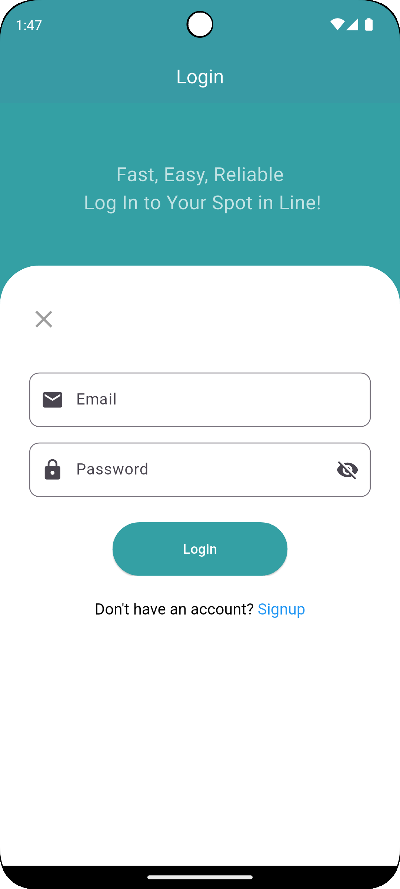
</p>
  
<h3>User:<h3>
<p align="center">
  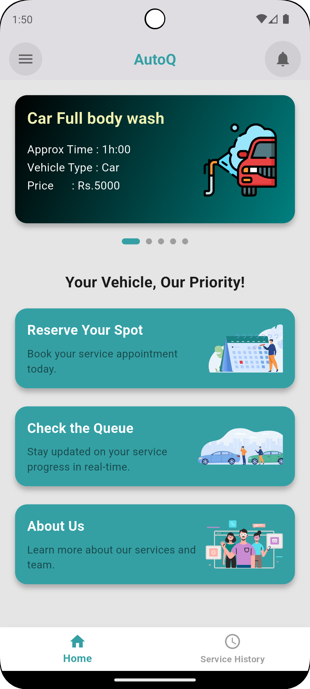
  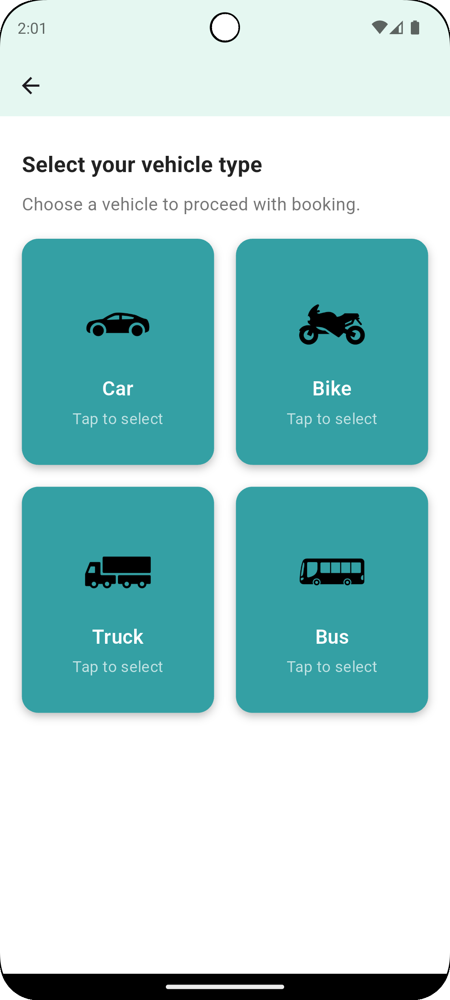
  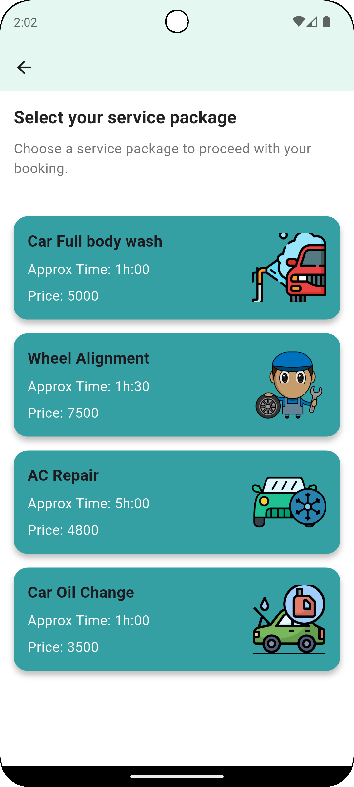
  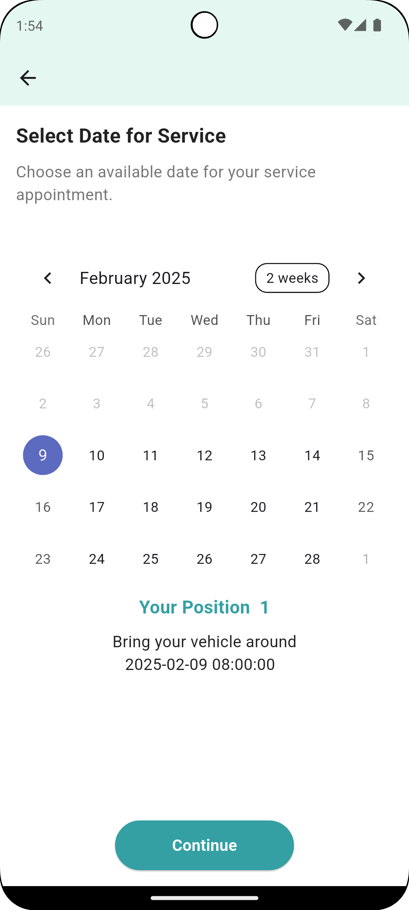
  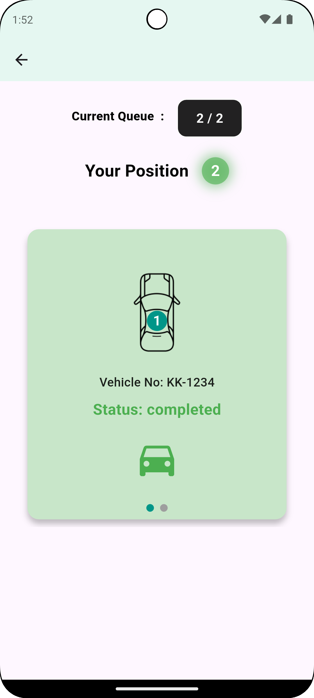
</p>
  
<h3>Admin:<h3>
<p align="center">
  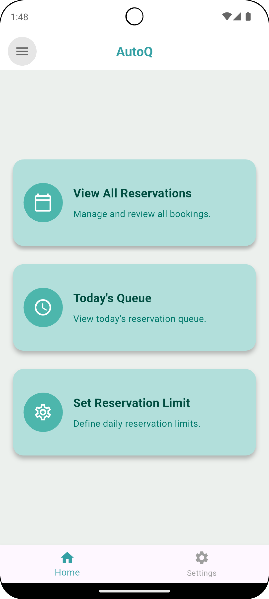
  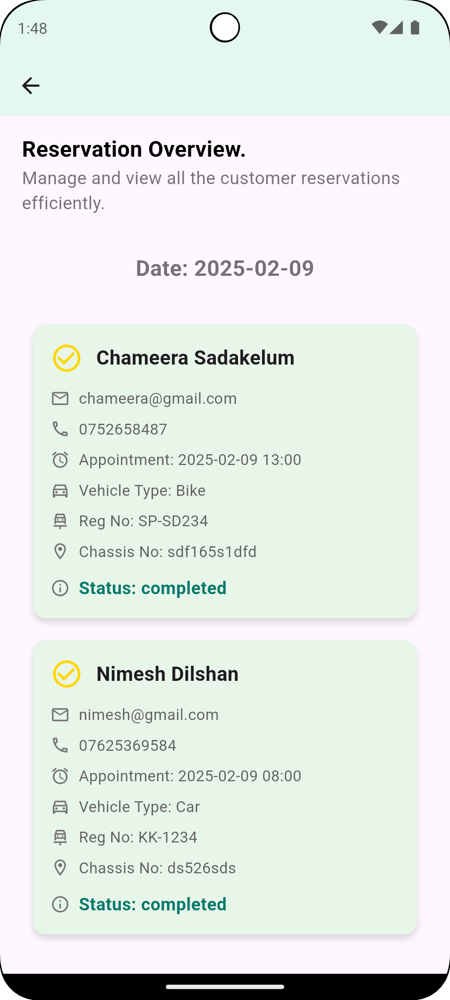
  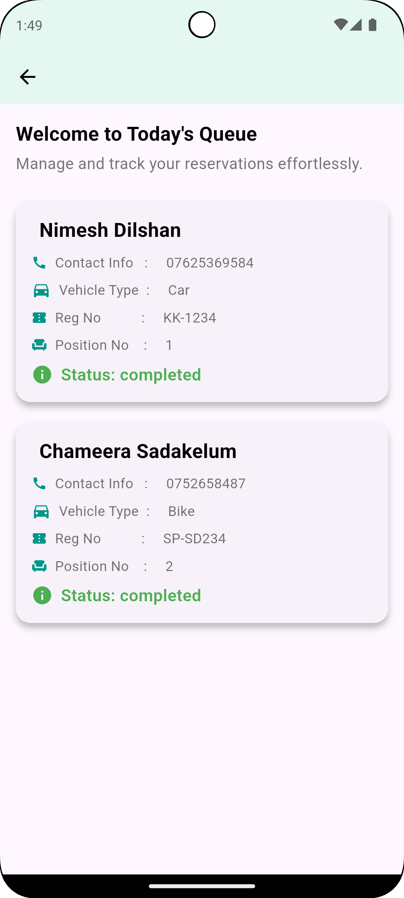
  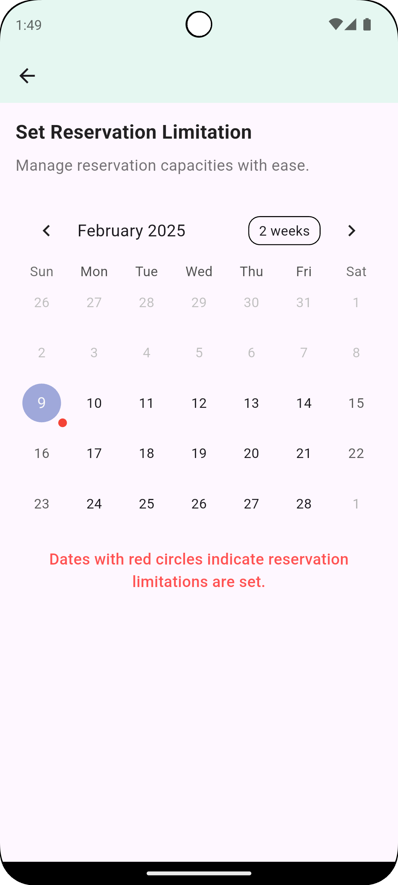
</p>


### Demonstration

Here's a short demonstration of the AutoQ:

<p align="center">
  <a href="https://youtu.be/sample-demo-link](https://youtu.be/BM-duwSDhAg)">
    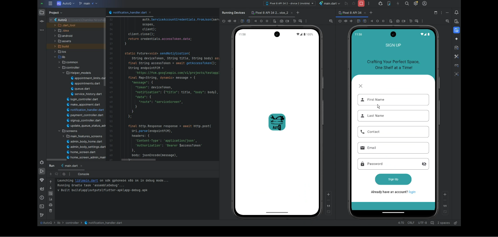
  </a>
</p>

   
